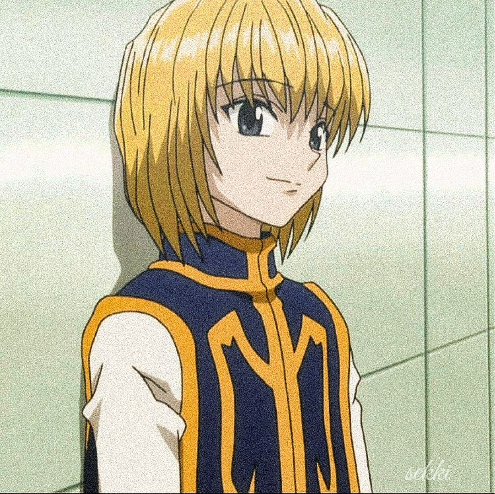

📌 Computer Science student, Java developer & A.I enthusiast

<h3 align="left">Connect with me!</h3>

<h3 align="left">My Stack</h3>

  
  
  
  
  
  
  
  
  
  
  
  

<h3>GitHub Stats</h3>

 

<picture>
  <source media="(prefers-color-scheme: dark)" srcset="https://raw.githubusercontent.com/abrxu/abrxu/output/github-contribution-grid-snake-dark.svg">
  <source media="(prefers-color-scheme: light)" srcset="https://raw.githubusercontent.com/abrxu/abrxu/output/github-contribution-grid-snake.svg">
  
</picture>
